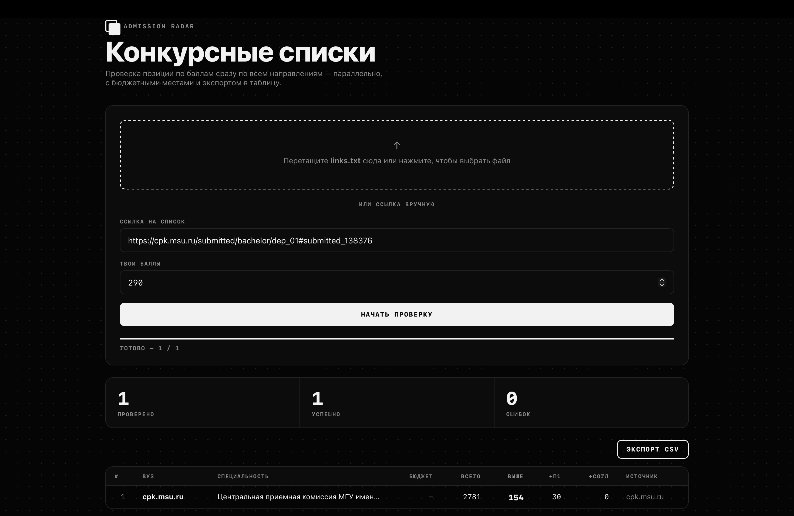
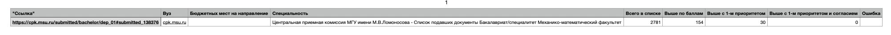

# Admission Radar

Check where you stand in Russian university admission competition lists —
across as many programs as you want, at once. Point it at a list URL (or a
whole file of them), give it your score, and it tells you how many
applicants are ranked above you, how many of those picked this program as
their #1 choice, and how many of *those* have already confirmed enrollment —
plus the number of budget-funded seats, pulled automatically from
vuzopedia.ru.

Ships as both a native desktop app and a CLI. Same engine underneath.


<p align="center">
  
  
</p>

---

## English

### What it does

For every list URL you give it, Admission Radar reports:

- **University** and **program name** (parsed straight off the page)
- **Budget-funded seats** for that program (from vuzopedia.ru)
- **Total applicants** in the competition list
- **Ranked above your score**
- **...and ranked #1 priority** for this program
- **...and already confirmed enrollment** (consent submitted)

It works against fairly different site architectures out of the box
(plain `<table>` markup, and FastReport's div-grid HTML5 export used by
some universities) and runs every URL **in parallel** in a single headless
Chromium instance, with automatic retry for anything that fails on the
first pass.

### Requirements

- Python 3.10+
- Google Chrome/Chromium gets installed automatically by Playwright (see below)

The CLI (`priem_check.py`) works the same on Windows, Linux and macOS —
Playwright handles that transparently. The desktop app (`priem_gui.py`)
renders its window through `pywebview`, which uses a different native
engine per OS:

- **macOS** — WKWebView, works out of the box (this is what's been tested).
- **Windows** — WebView2 (Edge Chromium). Preinstalled on Windows 11 and
  recent Windows 10 builds; older Windows 10 may need the
  [WebView2 Runtime](https://developer.microsoft.com/microsoft-edge/webview2/)
  installed separately.
- **Linux** — GTK + WebKitGTK (or Qt/QtWebEngine), as a **system package**,
  not something `pip` installs for you: e.g. on Debian/Ubuntu,
  `sudo apt install python3-gi gir1.2-webkit2-4.0`. Without it the GUI
  won't launch — the CLI is unaffected either way.

### Install

```bash
python3 -m venv .venv
source .venv/bin/activate        # Windows: .venv\Scripts\activate
pip install -r requirements.txt
playwright install chromium
```

### Run — desktop app

```bash
python priem_gui.py
```

Opens a native window (not a browser tab). From there:

1. **Drag & drop** a `links.txt` file onto the drop zone, or click it to
   browse for one — *or* just type a single URL into the field below it.
2. Enter **your score**.
3. Click **Начать проверку** (Start). A progress bar appears and results
   stream into the table as each link finishes — no need to wait for the
   whole batch.
4. Once done, click **Экспорт CSV** to save everything as a spreadsheet
   (native "Save As" dialog).

### Run — CLI

```bash
python priem_check.py
```

You'll be asked to either type one URL, or point it at a links file
(defaults to `links.txt` in the project root if you just hit Enter), then
your score. Results print to the terminal as each link resolves.

### `links.txt` format

One URL per line. Blank lines and lines starting with `#` are ignored:

```
# SPbSUITD
https://priem.sutd.ru/lists/1581#1

# ETU "LETI"
https://abit.etu.ru/ru/postupayushhim/lists/page/list#/?id=...
```

### Adding support for a new university

If a site isn't recognized, run:

```bash
python priem_debug.py <URL>
```

It dumps `page.html`, `page.png`, and `network.json` so you (or an
assistant) can see how that site's list is actually rendered — a real
`<table>`, or something else entirely — and extend `priem_check.py`
accordingly. See `CLAUDE.md` for the current parsing architecture if
you're working on this with an AI coding assistant.

### Known limitations

- "Confirmed enrollment" numbers are a rough position, not a full
  cross-program priority simulation (Russia dropped the second admission
  wave in 2023+; a truly accurate rank would require running every
  program's list simultaneously).
- Budget-seat lookup depends on vuzopedia.ru's own program naming/coding,
  so it won't resolve for every program — shows `—` rather than erroring.
- Paid-seat and quota-seat counts are *not* fetched: vuzopedia.ru gates
  those numbers behind account sign-in, and this tool won't try to
  automate around that.

---

## Русский

### Что делает

Для каждой ссылки на конкурсный список Admission Radar выдаёт:

- **Вуз** и **название направления** (парсятся прямо со страницы списка)
- **Бюджетные места** на это направление (с vuzopedia.ru)
- **Всего в списке** — сколько всего абитуриентов в конкурсе
- **Выше по баллам** — сколько абитуриентов набрали больше вас
- **...из них с 1-м приоритетом** — для скольких это направление в приоритете №1
- **...из них подавших согласие** — сколько уже подтвердили зачисление

Работает с довольно разными архитектурами сайтов из коробки (обычная
`<table>`, и div-grid HTML5-экспорт FastReport, который используют
некоторые вузы), и обрабатывает все ссылки **параллельно** в одном
headless-браузере, с автоматическим повтором для упавших с первого раза.

### Требования

- Python 3.10+
- Chromium ставится автоматически через Playwright (см. ниже)

Консоль (`priem_check.py`) одинаково работает на Windows, Linux и macOS —
Playwright сам всё разруливает. GUI (`priem_gui.py`) рендерит окно через
`pywebview`, а у него на каждой ОС свой нативный движок под капотом:

- **macOS** — WKWebView, работает из коробки (именно на этом всё тестировалось).
- **Windows** — WebView2 (Edge Chromium). Обычно уже стоит на Windows 11 и
  свежих сборках Windows 10; на старых Windows 10 может понадобиться
  отдельно поставить [WebView2 Runtime](https://developer.microsoft.com/microsoft-edge/webview2/).
- **Linux** — GTK + WebKitGTK (либо Qt/QtWebEngine) — это **системный пакет**,
  `pip` его не ставит: например, на Debian/Ubuntu —
  `sudo apt install python3-gi gir1.2-webkit2-4.0`. Без него GUI просто не
  запустится — на консоль это не влияет.

### Установка

```bash
python3 -m venv .venv
source .venv/bin/activate        # Windows: .venv\Scripts\activate
pip install -r requirements.txt
playwright install chromium
```

### Запуск — приложение

```bash
python priem_gui.py
```

Открывается нативное окно (не вкладка браузера). Дальше:

1. **Перетащите** файл `links.txt` в зону загрузки, или кликните по ней,
   чтобы выбрать файл — либо просто впишите одну ссылку в поле ниже.
2. Введите **свои баллы**.
3. Нажмите **«Начать проверку»**. Появится прогресс-бар, результаты
   заполняют таблицу по мере готовности каждой ссылки — не нужно ждать
   весь батч целиком.
4. По завершении нажмите **«Экспорт CSV»**, чтобы сохранить всё таблицей
   (откроется нативный диалог «Сохранить как»).

### Запуск — консоль

```bash
python priem_check.py
```

Скрипт спросит: ввести одну ссылку вручную или взять файл со списком
(по умолчанию — `links.txt` в корне проекта, если просто нажать Enter),
затем — ваши баллы. Результаты печатаются в терминал по мере готовности
каждой ссылки.

### Формат `links.txt`

Одна ссылка на строку. Пустые строки и строки, начинающиеся с `#`,
игнорируются:

```
# СПбГУПТД
https://priem.sutd.ru/lists/

# СПбГЭТУ «ЛЭТИ»
https://abit.etu.ru/ru/postupayushhim/lists/page/list#/?id=...
```

### Как добавить поддержку нового вуза

Если сайт не распознаётся, запустите:

```bash
python priem_debug.py <URL>
```

Скрипт сохранит `page.html`, `page.png` и `network.json` — по ним видно,
как на самом деле рендерится список: настоящая `<table>` или что-то
совсем другое, — и можно доработать `priem_check.py`. Если работаете
над этим с ИИ-ассистентом, текущая архитектура парсинга описана в
`CLAUDE.md`.

### Известные ограничения

- «Подано согласие» показывает грубую позицию, а не полную симуляцию
  единого приоритета по всем направлениям сразу (после отмены второй
  волны зачисления в 2023+ по-настоящему точный расчёт места требует
  одновременной прогонки по спискам всех вузов, куда подал абитуриент).
- Поиск бюджетных мест зависит от того, как именно направление названо
  на vuzopedia.ru — не для каждого направления находится; в этом случае
  просто «—», без ошибки.
- Платные места и места по квотам **не** запрашиваются: на vuzopedia.ru
  эти цифры закрыты регистрацией/входом в аккаунт, и этот инструмент
  сознательно не пытается это обходить.
